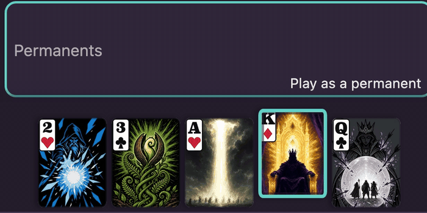

# Cuttle

  

<b>A card duel for two, played with an ordinary deck.</b>

<a href="https://apismellow.github.io/cuttle-web/"><b>▶ Play now</b></a>

Cuttle feels like Magic: The Gathering, except all you need is the 52-card deck in your kitchen drawer. Every card gives you a choice. You can lay it down for points, or you can spend it for what it does:

- a **Jack** steals your opponent's best points card
- a **Queen** shields your side of the table
- a **King** brings your finish line closer
- an **Ace** wipes every points card off the table
- a **Two** cancels your opponent's trick at the last second

The first player to 21 points wins. Games are quick, and one bad trade can swing the whole thing.

## Try it

Open the [game](https://apismellow.github.io/cuttle-web/) on a phone and hand it across the table. It's pass-and-play, so your hand stays hidden while the phone changes hands. You don't need an account and there's nothing to install. It also works on a laptop.

Not sure what a card does? Tap it and the game tells you. The [card gallery](https://apismellow.github.io/cuttle-web/gallery/) shows off the full Mythic deck.

---

Built on the open-source <a href="https://github.com/ApisMellow/cuttle">Cuttle engine</a>. Want to hack on it? Start with <a href="AGENTS.md">AGENTS.md</a> and <a href="docs/SPEC.md">docs/SPEC.md</a>.
