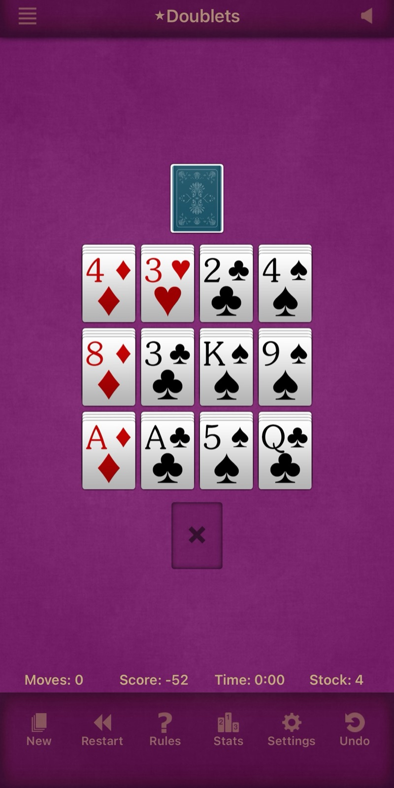
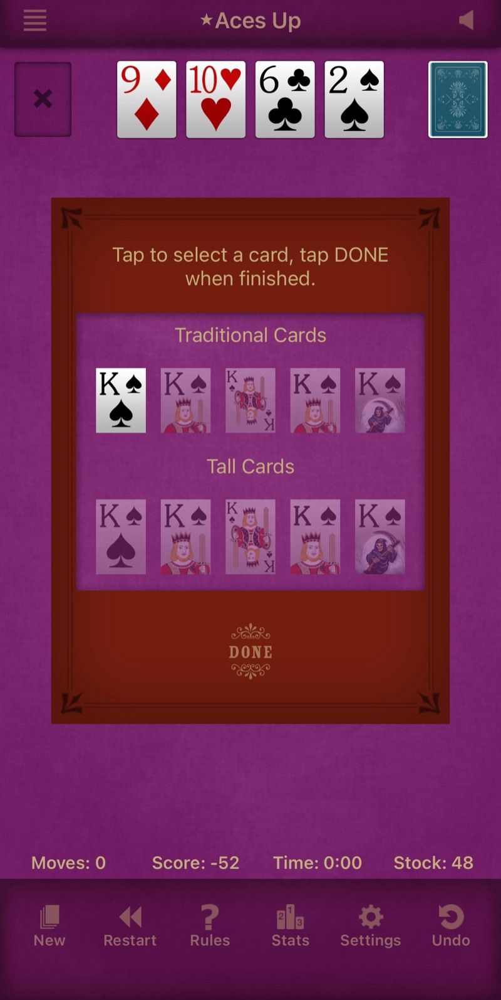

# Design references

Screenshots the product owner picked as targets for the look of Cuttle Web. **Designers and developers: read this before working on card faces, the table, or menus.** The images are for direction only; don't copy their assets.

## Card legibility and table look (2026-09-29)

This is the target for the **standard (Classic) card set**, the **table**, and **menu-first settings**. The roadmap items that point here are "Clearer spades and clubs", "Classic card redesign" and "Menu-first settings".

**Card faces**
- Proportion close to a real card, about 5:7 portrait, not squat.
- A large corner index. The rank is about a third of the card's width, in a sturdy serif, with the suit pip beside it at the same height, so it reads from arm's length.
- One big centre pip under the index instead of a full pip layout, so the suit reads at a glance even on small cards.
- Spades and clubs never look alike: the club's three round lobes against the spade's pointed leaf.
- A plain white face with a faint top-to-bottom gradient, a thin grey edge, a small corner radius and a soft shadow. Only two ink colours, a clear red and a near-black.

**Table**
- A textured felt surface (purple in the reference), framed by a darker top bar and bottom toolbar.
- Stacked cards show thin page edges above the top card, so the pile's depth reads at a glance.
- An empty slot is a darker inset rectangle with a marker.

**Menus and settings**
- A hamburger menu in the top bar (top-left in the reference), the game title centred, one secondary icon on the right.
- A bottom toolbar of icon-plus-label actions for common commands.
- Options such as the card style live in a sheet behind the menu, not as selectors on the front screen. In the reference, the style sheet offers "Traditional" and "Tall" rows, each with a pip-only face and illustrated courts.
